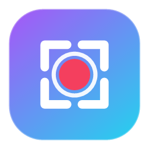

# StreamHUD

### Overlays e HUD profissionais para suas lives — sem complicação.

Um estúdio de **desktop** que gera overlays customizáveis e atualiza o seu OBS **ao vivo**, com integração nativa à **Twitch**.

 

---

## ✨ O que é

**StreamHUD** é um aplicativo para Windows que funciona como um *estúdio de overlays*. Você personaliza tudo numa interface visual — cores, textos, widgets, cenas — e o **OBS** (ou qualquer software com *Browser Source*) reflete as mudanças **na hora**, sem recarregar nada.

Tudo roda **localmente** na sua máquina: o app sobe um servidor que entrega o overlay para o OBS.

## 🎬 Recursos

- **4 cenas prontas** — Live, Começando em breve, Já volto e Encerramento
- **Tema 100% customizável** — cores, fontes, presets (Cyberpunk, Synthwave, Vaporwave…), brilho e efeito *scanline*
- **Widgets arrastáveis e redimensionáveis** — posicione e dimensione cada bloco, um a um, direto no preview
- **Widgets personalizados** — adicione **texto**, **imagem** e **contador** (o contador pode ser controlado por **comando no chat**, ex.: `!mortes +1`)
- **Integração com a Twitch**
  - Chat, **subs**, resubs, gifts e **raids** — sem login
  - **Follows** via login seguro (OAuth)
- **Alertas** com som e **transições** de cena
- **Metas/goals**, ticker, redes sociais e atividade recente
- **Atualização automática** — o app avisa quando há versão nova

## ⬇️ Download e instalação

1. Baixe o instalador na **[última versão](https://github.com/arthurantunes/StreamHUD-releases/releases/latest)**.
2. Rode o `StreamHUD-Setup-x.x.x.exe` — **instala sem precisar de administrador**.
3. Abra o StreamHUD.

### Colocar no OBS (≈ 30s)

1. Mantenha o **StreamHUD aberto** (é ele que serve o overlay).
2. No OBS, adicione uma fonte **Navegador / Browser Source**.
3. Cole a URL da cena (botões *"Copiar URL p/ OBS"* no topo do app).
4. Defina **1920 × 1080**.

> 📘 Guias passo a passo do **OBS** e da **Twitch** já vêm embutidos no aplicativo.

## 💻 Requisitos

- **Windows 10 ou 11** (64-bit)
- **OBS Studio** (ou outro software com *Browser Source*)
- **Não** precisa instalar o .NET — o app é *self-contained*

## 🔄 Atualizações

O StreamHUD verifica novas versões automaticamente e baixa com **1 clique**. Suas configurações são **preservadas** ao atualizar.

## 📦 Sobre este repositório

Este repositório contém **apenas os instaladores** (releases) do StreamHUD. O código-fonte é mantido em repositório privado.

---

⚠️ Em **beta** — pode receber atualizações frequentes. Encontrou um problema ou tem uma sugestão? Abra uma *issue*.

Feito com 💜 para a comunidade de streamers.

